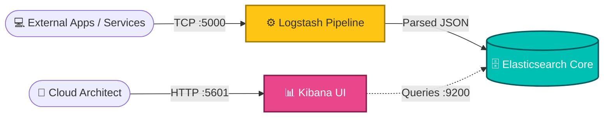

# 👁️ Enterprise Observability: ELK Stack


## 📌 Project Overview
A production-grade Centralized Logging and Observability platform utilizing the **ELK Stack** (Elasticsearch, Logstash, Kibana) deployed via Docker Compose. This architecture is designed to ingest, parse, and visualize logs from microservices and distributed systems in real-time.

## 📂 Repository Structure
```text
.
├── logstash/
│   └── logstash.conf      # TCP input and JSON parsing configurations
├── assets/
│   └── kibana-log.png     # Live ingestion proof of concept
├── docker-compose.yml     # Orchestrates the ELK stack & virtual networks
└── README.md              # Project documentation


```

## 🏗️ System Architecture

The logging pipeline is engineered to decouple log ingestion from storage. Logstash acts as the primary buffer and parser, transforming raw JSON logs before persisting them into Elasticsearch for rapid querying via Kibana.



## 💡 Key Features & Technical Decisions

- **Kernel Optimization:** Requires host machine `vm.max_map_count` modification to prevent Elasticsearch out-of-memory crashes, ensuring enterprise-level stability and performance.
- **Resource Constraints:** Elasticsearch JVM options (`ES_JAVA_OPTS`) are strictly configured to a 512MB limit (`-Xms512m -Xmx512m`) to prevent container resource exhaustion and maintain host efficiency.
- **Strict Network Isolation:** The entire observability stack communicates over a custom internal Docker bridge network (`observability_net`), securing database traffic and preventing unauthorized external access.
- **Decoupled Pipeline Architecture:** Utilizing Logstash as an intermediary buffer enables advanced log filtering, JSON parsing, and data mutation before the payload reaches the Elasticsearch storage tier.
- **Real-Time Data Indexing:** Dynamically generates daily index patterns (`enterprise-logs-%{+YYYY.MM.DD}`) for efficient log rotation and lifecycle management.

## 📸 Project Showcase (Proof of Concept)

### 1. Real-Time Log Ingestion & JSON Parsing
The core of the observability platform. Logstash successfully parses incoming JSON payloads, breaking them down into searchable fields (`app`, `engineer`, `level`), which are instantly indexed and visualized in Kibana.

<p align="center">
  
</p>

### 2. Automated Index Discovery
Proof of seamless integration between the storage tier (Elasticsearch) and the visualization tier (Kibana), successfully matching dynamically generated daily indices.

<p align="center">
  
</p>

### 3. Infrastructure Health & Resource Constraints
Executing `docker compose ps` and `docker stats` demonstrates the stack running reliably. Notice that the Elasticsearch container adheres strictly to the defined JVM heap size constraints (`-Xms512m -Xmx512m`), preventing host machine resource exhaustion.

<p align="center">
  
  
</p>

🚀 Getting Started
1. Host Machine Preparation (Crucial)

Increase the virtual memory mapping limits on your Linux host:
sudo sysctl -w vm.max_map_count=262144

2. Build and Deploy

Launch the observability stack:
docker compose up -d

3. Verify Ingestion via Netcat

Simulate a microservice sending a JSON log to the pipeline:
echo '{"app": "Test-Service", "message": "The Enterprise Observability Stack is fully operational!", "level": "INFO"}' | nc localhost 5000

4. Access the Dashboard

Navigate to http://localhost:5601, create a Data View for enterprise-logs-*, and start exploring your data in the Discover tab.

**Architected by:** Ahmed Mohamed Abbas Bahij

[](https://www.linkedin.com/in/ahmedabbas99)

Cloud Infrastructure & DevOps Engineer 
